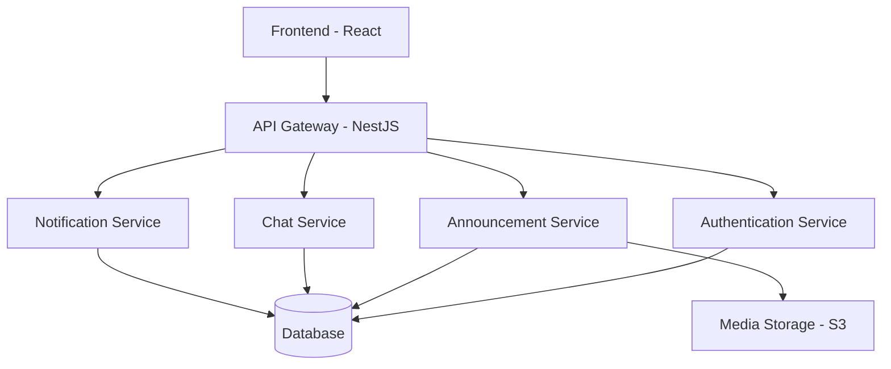

# Donation Platform Technical Proposal

## 1. System Architecture

### 1.1 Technology Stack Selection

**Frontend:**
- React.js with TypeScript
- Justification: 
  - Strong type safety with TypeScript
  - Component reusability for consistent UI
  - Rich ecosystem of libraries
  - Better state management with React Query
  - Excellent developer tools and debugging

**Backend:**
- NestJS with Prisma
- Justification:
  - TypeScript-first approach matches frontend
  - Built-in dependency injection
  - Module-based architecture for scalability
  - Prisma provides type-safe database access
  - Better real-time capabilities for chat feature

**Database:**
- PostgreSQL with Prisma as ORM
- Justification:
  - Robust full-text search capabilities
  - JSONB support for flexible data
  - Strong consistency and ACID compliance
  - Excellent geospatial support via PostGIS

### 1.2 System Components



## 2. Database Schema

### 2.1 Core Entities

```sql
-- Users
CREATE TABLE users (
  id UUID PRIMARY KEY,
  role ENUM ('DONOR', 'BENEFICIARY', 'MANAGER'),
  first_name VARCHAR(100),
  last_name VARCHAR(100),
  city VARCHAR(100),
  email VARCHAR(255) UNIQUE,
  username VARCHAR(50) UNIQUE,
  password_hash VARCHAR(255),
  created_at TIMESTAMP,
  updated_at TIMESTAMP
);

-- Announcements
CREATE TABLE announcements (
  id UUID PRIMARY KEY,
  user_id UUID REFERENCES users(id),
  title VARCHAR(200),
  description TEXT,
  condition VARCHAR(50),
  purchase_date DATE,
  category VARCHAR(100),
  object_name VARCHAR(100),
  status ENUM ('ACTIVE', 'RESERVED', 'COMPLETED'),
  location POINT,
  created_at TIMESTAMP,
  updated_at TIMESTAMP
);

-- Media
CREATE TABLE media (
  id UUID PRIMARY KEY,
  announcement_id UUID REFERENCES announcements(id),
  url VARCHAR(500),
  type ENUM ('IMAGE', 'VIDEO'),
  created_at TIMESTAMP
);

-- Chat Messages
CREATE TABLE messages (
  id UUID PRIMARY KEY,
  sender_id UUID REFERENCES users(id),
  receiver_id UUID REFERENCES users(id),
  announcement_id UUID REFERENCES announcements(id),
  content TEXT,
  read BOOLEAN DEFAULT false,
  created_at TIMESTAMP
);

-- Notifications
CREATE TABLE notifications (
  id UUID PRIMARY KEY,
  user_id UUID REFERENCES users(id),
  type ENUM ('NEW_MATCH', 'STATUS_CHANGE', 'MESSAGE'),
  content JSON,
  read BOOLEAN DEFAULT false,
  created_at TIMESTAMP
);
```

## 3. API Specifications

### 3.1 Authentication Endpoints

```typescript
// POST /auth/register
interface RegisterDTO {
  firstName: string;
  lastName: string;
  city: string;
  email: string;
  username: string;
  password: string;
  role: 'DONOR' | 'BENEFICIARY' | 'MANAGER';
}

// POST /auth/login
interface LoginDTO {
  username: string;
  password: string;
}
```

### 3.2 Announcement Endpoints

```typescript
// POST /announcements
interface CreateAnnouncementDTO {
  title: string;
  description: string;
  condition: string;
  purchaseDate: Date;
  category: string;
  objectName: string;
  location: {
    lat: number;
    lng: number;
  };
  media: {
    type: 'IMAGE' | 'VIDEO';
    url: string;
  }[];
}

// GET /announcements
interface FilterDTO {
  city?: string;
  category?: string;
  objectName?: string;
  bounds?: {
    ne: { lat: number; lng: number };
    sw: { lat: number; lng: number };
  };
}
```

## 4. Implementation Roadmap

### Phase 1: Core Features (Weeks 1-4)
- User authentication system
- Basic announcement CRUD
- Simple listing view
- Basic search functionality

### Phase 2: Enhanced Features (Weeks 5-8)
- Advanced filtering
- Map integration
- Media upload system
- Dashboard views

### Phase 3: Optional Features (Weeks 9-12)
- Chat system
- Notification system
- Real-time updates
- Analytics dashboard

## 5. Risk Assessment

### 5.1 Technical Risks

1. **Media Storage Scalability**
   - Risk: Large media files impacting performance
   - Mitigation: 
     - Implement client-side image compression
     - Use S3 with CloudFront CDN
     - Implement upload size limits

2. **Search Performance**
   - Risk: Slow search with large dataset
   - Mitigation:
     - Implement elasticsearch for full-text search
     - Add database indexes
     - Implement result pagination

3. **Real-time Features**
   - Risk: WebSocket scaling issues
   - Mitigation:
     - Use Redis for pub/sub
     - Implement connection pooling
     - Add fallback to polling

### 5.2 Security Considerations

1. **Data Protection**
   - Implement GDPR-compliant data handling
   - Secure media access control
   - Regular security audits

2. **Authentication**
   - JWT with short expiration
   - Refresh token rotation
   - Rate limiting on auth endpoints

## 6. UI/UX Wireframes

Key screens will include:

1. Registration/Login
2. Announcement Creation Form
3. Listing View with Filters
4. User Dashboard
5. Chat Interface
6. Notification Center

## 7. Performance Optimization

1. **Frontend**
   - Implement code splitting
   - Use React.lazy for component loading
   - Optimize bundle size
   - Implement service worker for offline support

2. **Backend**
   - Implement caching strategy
   - Database query optimization
   - API response compression
   - Rate limiting

## 8. Monitoring and Analytics

1. **System Monitoring**
   - Error tracking (Sentry)
   - Performance monitoring (New Relic)
   - API usage metrics

2. **User Analytics**
   - User engagement metrics
   - Search pattern analysis
   - Conversion tracking

## 9. Future Extensibility

The system is designed to be modular, allowing for:
- Additional user roles
- New notification types
- Enhanced search capabilities
- Integration with external services
- Mobile app development

## 10. Development Environment

- Docker for containerization
- GitHub Actions for CI/CD
- Staging and production environments
- Automated testing setup